# AI Leadership Insight & Decision Agent

> An AI-powered assistant for organizational leadership — answers strategic questions grounded in company documents using Advanced RAG with open-source models.

---

## Table of Contents

- [Architecture Decisions](#architecture-decisions)
- [Provider Architecture](#provider-architecture-pluggable-llm--embedding)
- [High-Level System Architecture](#high-level-system-architecture)
- [Document Ingestion Pipeline](#document-ingestion-pipeline)
- [Query Processing & Retrieval Pipeline](#query-processing--retrieval-pipeline)
- [Advanced RAG Flow (Detailed)](#advanced-rag-flow-detailed)
- [Agent Workflow (Task 2 Extensibility)](#agent-workflow-task-2-extensibility)
- [Tech Stack](#tech-stack)
- [Data Models & Schema](#data-models--schema)
- [Project Structure](#project-structure)
- [Setup & Running](#setup--running)
- [Evaluation](#evaluation)
- [Assumptions](#assumptions)

---

## Architecture Decisions

| Dimension | Decision | Rationale |
|---|---|---|
| **Document Formats** | PDF, DOCX, PPTX, XLSX/CSV, MD/TXT | Covers all typical corporate document types |
| **Document Parsing** | `unstructured.io` | Unified API for all formats; preserves tables, headers, lists |
| **Chunking Strategy** | Semantic + Table-aware + Parent-Child | Preserves document structure; tables as atomic units; small chunks for retrieval, large for LLM context |
| **Embedding Model** | **Default:** `BAAI/bge-large-en-v1.5` (local, 1024d)<br/>**Optional:** `OpenAI text-embedding-3-small` | Default runs locally with no API cost; OpenAI option for users who prefer managed embeddings |
| **Vector Database** | Qdrant | Built-in hybrid search (vector + BM25), metadata filtering, Rust-fast, production-ready |
| **Re-ranker** | `cross-encoder/ms-marco-MiniLM-L-6-v2` | Fast cross-encoder re-ranking; filters top-20 → top-5 for LLM |
| **LLM** | **Default:** Llama 3.2 3B via Ollama<br/>**Optional:** OpenAI GPT-4o / GPT-4o-mini, Anthropic Claude 3.5 Sonnet | Default is fully open-source & local; commercial APIs available via config for higher-quality reasoning |
| **RAG Pattern** | Advanced RAG | Query rewriting + hybrid retrieval + re-ranking + structured generation |
| **Framework** | LlamaIndex (RAG) + LangGraph (Agent) | LlamaIndex: purpose-built for document QA; LangGraph: agentic workflows for Task 2 |
| **Interface** | Streamlit | Fast to build, interactive, professional for demos |
| **Output** | Structured report + citations + charts + confidence | Leadership-grade output with traceability |
| **Sample Data** | Public SEC filings + synthetic internal docs | Realistic, reproducible, diverse |
| **Scope** | Task 1 full + Task 2 architecture-ready | Solid foundation with extensibility |

---

## Provider Architecture (Pluggable LLM & Embedding)

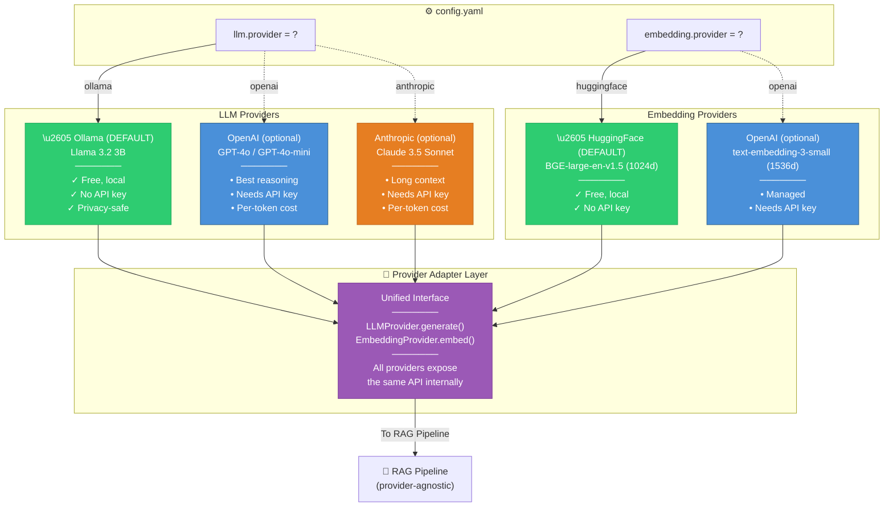

> **Design principle:** The RAG pipeline is **provider-agnostic**. All LLM/embedding interactions go through a unified adapter. Switching from Ollama to OpenAI is a one-line config change — no code modifications needed. Solid lines = default path, dashed = optional.

---

## High-Level System Architecture

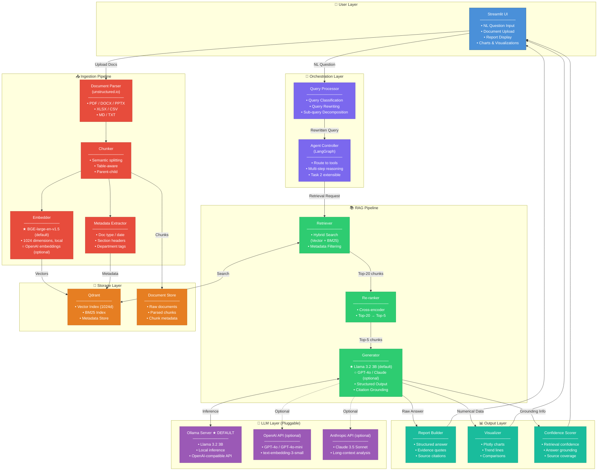

---

## Document Ingestion Pipeline

This pipeline runs once per document batch (or incrementally when new documents are added).

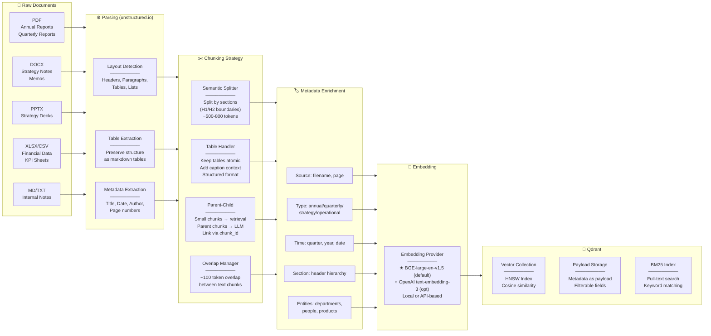

### Chunking Detail — Parent-Child Strategy

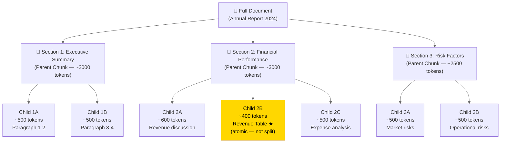

> **Key insight:** Child chunks (small, ~500 tokens) are embedded and retrieved. When a child matches, its **parent chunk** (larger, ~2000 tokens) is sent to the LLM for richer context. Tables are never split — they're treated as atomic chunks.

---

## Query Processing & Retrieval Pipeline

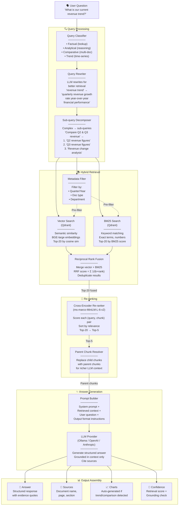

---

## Advanced RAG Flow (Detailed)

### Retrieval Scoring — Reciprocal Rank Fusion

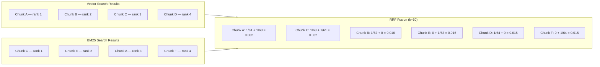

### Structured Output Schema

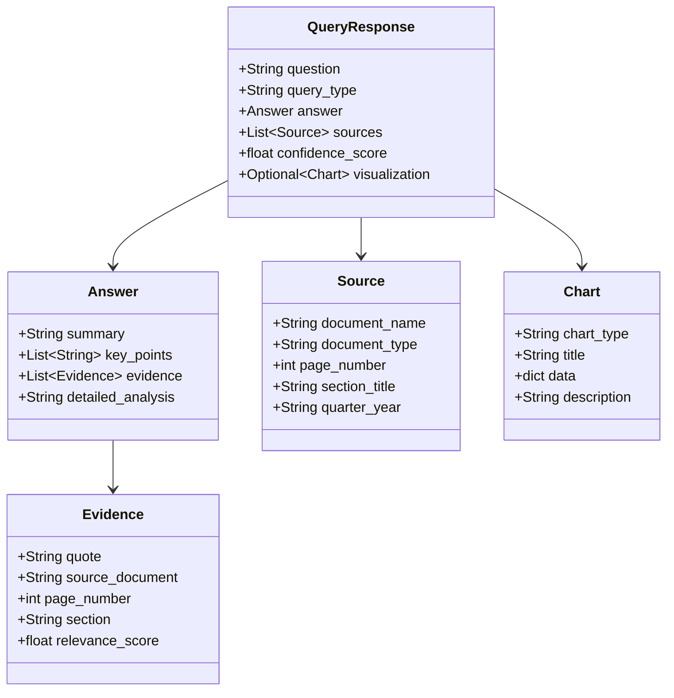

---

## Agent Workflow (Task 2 Extensibility)

The system is designed with LangGraph so it can evolve from a simple RAG pipeline (Task 1) to an autonomous agent (Task 2).

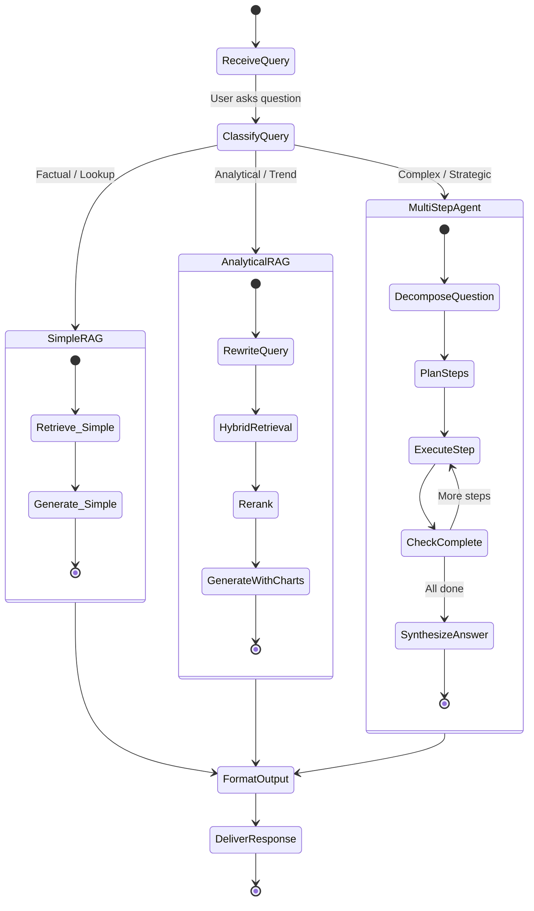

### LangGraph Node Design (Task 2 Ready)

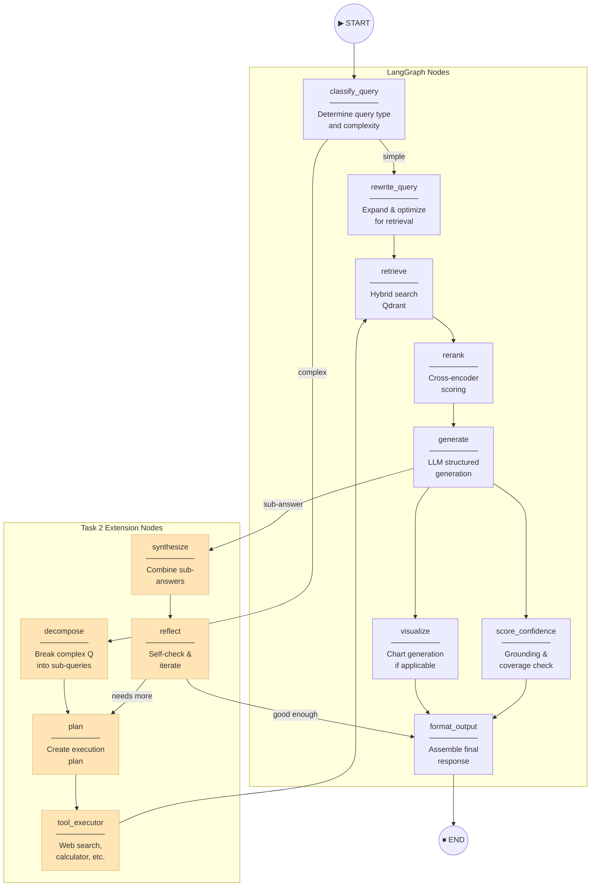

---

## Tech Stack

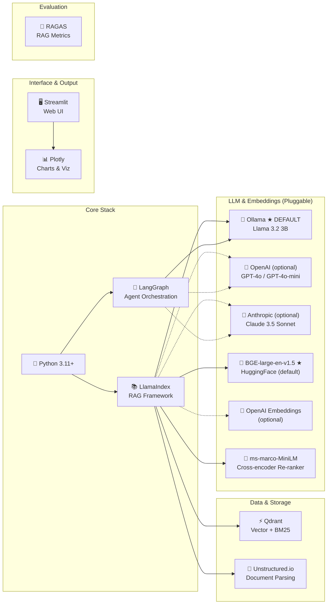

---

## Data Models & Schema

### Qdrant Collection Schema

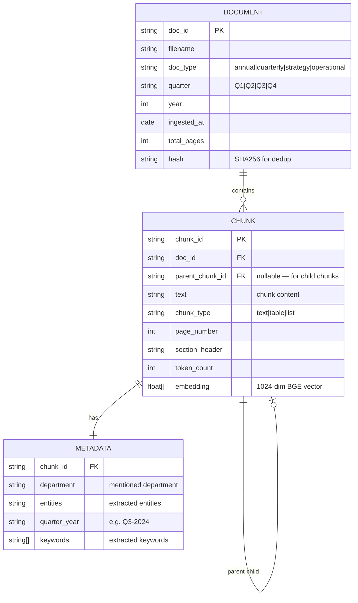

---

## Project Structure

```
ai-leadership-agent/
├── README.md                          # This file — architecture & setup
├── config.yaml                        # Model names, API configs, parameters
├── requirements.txt                   # Python dependencies
├── docker-compose.yml                 # Qdrant (required) + Ollama (optional) services
│
├── data/
│   ├── raw/                           # Raw company documents (PDF, DOCX, etc.)
│   ├── sample/                        # Sample documents for demo
│   └── evaluation/                    # Q&A pairs for validation
│
├── src/
│   ├── __init__.py
│   ├── config.py                      # Configuration loader
│   │
│   ├── providers/                     # Pluggable Provider Adapter Layer
│   │   ├── __init__.py
│   │   ├── llm_provider.py            # Unified LLM interface (Ollama/OpenAI/Anthropic)
│   │   └── embedding_provider.py      # Unified embedding interface (HuggingFace/OpenAI)
│   │
│   ├── ingestion/                     # Document Ingestion Pipeline
│   │   ├── __init__.py
│   │   ├── parser.py                  # Document parsing (unstructured.io)
│   │   ├── chunker.py                 # Semantic + table-aware chunking
│   │   ├── embedder.py                # BGE-large embedding
│   │   ├── metadata.py                # Metadata extraction & enrichment
│   │   └── pipeline.py                # Orchestrates full ingestion
│   │
│   ├── retrieval/                     # Retrieval & Re-ranking
│   │   ├── __init__.py
│   │   ├── hybrid_search.py           # Vector + BM25 hybrid retrieval
│   │   ├── reranker.py                # Cross-encoder re-ranking
│   │   ├── query_processor.py         # Query classification & rewriting
│   │   └── parent_resolver.py         # Parent chunk resolution
│   │
│   ├── generation/                    # Answer Generation
│   │   ├── __init__.py
│   │   ├── generator.py               # LLM-based answer generation
│   │   ├── prompts.py                 # System/user prompt templates
│   │   ├── output_schema.py           # Pydantic output models
│   │   └── confidence.py              # Confidence scoring
│   │
│   ├── visualization/                 # Chart Generation
│   │   ├── __init__.py
│   │   └── chart_builder.py           # Plotly chart generation
│   │
│   └── agent/                         # Agent Layer (Task 2 extensible)
│       ├── __init__.py
│       ├── graph.py                   # LangGraph workflow definition
│       ├── nodes.py                   # Individual graph nodes
│       └── tools.py                   # Agent tools (retrieval, calc, etc.)
│
├── app.py                             # Streamlit application entry
├── ingest.py                          # CLI: python ingest.py ./data/raw/
├── evaluate.py                        # CLI: run RAGAS evaluation
│
└── tests/
    ├── test_ingestion.py
    ├── test_retrieval.py
    └── test_generation.py
```

---

## Setup & Running

### Prerequisites

#### Option A: Open-Source Stack (Default — no API keys needed)

```bash
# 1. Install Ollama and pull the model
curl -fsSL https://ollama.ai/install.sh | sh
ollama pull llama3.2:3b

# 2. Start Qdrant (via Docker)
docker run -d --name qdrant -p 6333:6333 -p 6334:6334 qdrant/qdrant

# 3. Install Python dependencies
pip install -r requirements.txt

# 4. Configure (default config works out of the box)
cp config.example.yaml config.yaml
```

#### Option B: Using OpenAI / Anthropic (Optional)

```bash
# 1. Start Qdrant (via Docker) — still needed for vector storage
docker run -d --name qdrant -p 6333:6333 -p 6334:6334 qdrant/qdrant

# 2. Install Python dependencies
pip install -r requirements.txt

# 3. Set your API key(s)
export OPENAI_API_KEY="sk-..."
# or
export ANTHROPIC_API_KEY="sk-ant-..."

# 4. Configure — uncomment the desired provider in config.yaml
cp config.example.yaml config.yaml
# Edit config.yaml: change llm.provider to "openai" or "anthropic"
```

### Usage

```bash
# Ingest documents
python ingest.py ./data/raw/

# Launch the UI
streamlit run app.py

# Run evaluation
python evaluate.py
```

### Configuration (`config.yaml`)

```yaml
# ─────────────────────────────────────────────
# LLM Provider (pick one: ollama | openai | anthropic)
# ─────────────────────────────────────────────
llm:
  provider: "ollama"                  # ★ DEFAULT: fully open-source, local
  model: "llama3.2:3b"
  base_url: "http://localhost:11434"   # Ollama server URL
  temperature: 0.1

# --- To use OpenAI instead (optional): ---
# llm:
#   provider: "openai"
#   model: "gpt-4o-mini"              # or "gpt-4o" for best quality
#   api_key: "${OPENAI_API_KEY}"      # set via env var or paste here
#   temperature: 0.1

# --- To use Anthropic instead (optional): ---
# llm:
#   provider: "anthropic"
#   model: "claude-3-5-sonnet-20241022"
#   api_key: "${ANTHROPIC_API_KEY}"   # set via env var or paste here
#   temperature: 0.1

# ─────────────────────────────────────────────
# Embedding Model
# ─────────────────────────────────────────────
embedding:
  provider: "huggingface"             # ★ DEFAULT: local, no API key needed
  model: "BAAI/bge-large-en-v1.5"
  device: "cpu"                       # cpu | cuda
  batch_size: 32

# --- To use OpenAI embeddings instead (optional): ---
# embedding:
#   provider: "openai"
#   model: "text-embedding-3-small"   # 1536 dims
#   api_key: "${OPENAI_API_KEY}"

reranker:
  model: "cross-encoder/ms-marco-MiniLM-L-6-v2"
  top_k: 5

retrieval:
  initial_top_k: 20                   # retrieve top-20 before re-ranking
  hybrid_alpha: 0.6                    # weight: 0=BM25 only, 1=vector only
  chunk_size: 600
  chunk_overlap: 100

qdrant:
  host: "localhost"
  port: 6333
  collection: "company_docs"

ui:
  title: "AI Leadership Insight Agent"
  max_sources: 5
```

---

## Evaluation

| Metric | Description | Target |
|--------|-------------|--------|
| **Faithfulness** | Is the answer grounded in retrieved context? (no hallucination) | > 0.85 |
| **Answer Relevancy** | Does the answer address the question? | > 0.80 |
| **Context Precision** | Are the retrieved chunks relevant? | > 0.75 |
| **Context Recall** | Did we retrieve all needed information? | > 0.70 |

Evaluation uses a hand-crafted validation set of ~10-15 Q&A pairs based on the sample documents.

---

## Assumptions

1. **Documents are text-extractable** — no scanned/OCR PDFs (would need Tesseract/Azure Doc Intelligence)
2. **Document scale: 10-50 documents**, up to 200 pages each — sufficient for the demo
3. **Single-user system** — no concurrency considerations for the assignment
4. **English-only** documents and queries
5. **Default stack is fully open-source** — Ollama (Llama 3.2 3B) + BGE embeddings, no API keys required
6. **OpenAI / Anthropic are optional** — reviewer can switch to `gpt-4o`, `gpt-4o-mini`, or `claude-3.5-sonnet` by updating `config.yaml` and setting an env var
7. **Docker available** for running Qdrant
8. **No real-time data** — documents are ingested in batch, not streaming
9. **Charts are auto-triggered** when the query classifier detects trend/comparison questions
10. **Task 2 architecture is designed but not fully implemented** — LangGraph nodes are stubbed for extension