```mermaid
graph TB
    subgraph USER["👤 User Layer"]
        UI["Streamlit UI<br/>─────────────<br/>• NL Question Input<br/>• Document Upload<br/>• Report Display<br/>• Charts & Visualizations"]
    end

    subgraph ORCHESTRATOR["🧠 Orchestration Layer"]
        QP["Query Processor<br/>─────────────<br/>• Query Classification<br/>• Query Rewriting<br/>• Sub-query Decomposition"]
        AG["Agent Controller<br/>(LangGraph)<br/>─────────────<br/>• Route to tools<br/>• Multi-step reasoning<br/>• Task 2 extensible"]
    end

    subgraph RAG["📚 RAG Pipeline"]
        RT["Retriever<br/>─────────────<br/>• Hybrid Search<br/>(Vector + BM25)<br/>• Metadata Filtering"]
        RR["Re-ranker<br/>─────────────<br/>• Cross-encoder<br/>• Top-20 → Top-5"]
        GN["Generator<br/>─────────────<br/>★ Llama 3.2 3B (default)<br/>○ GPT-4o / Claude (optional)<br/>• Structured Output<br/>• Citation Grounding"]
    end

    subgraph STORAGE["💾 Storage Layer"]
        QD["Qdrant<br/>─────────────<br/>• Vector Index (1024d)<br/>• BM25 Index<br/>• Metadata Store"]
        DS["Document Store<br/>─────────────<br/>• Raw documents<br/>• Parsed chunks<br/>• Chunk metadata"]
    end

    subgraph INGESTION["📥 Ingestion Pipeline"]
        DP["Document Parser<br/>(unstructured.io)<br/>─────────────<br/>• PDF / DOCX / PPTX<br/>• XLSX / CSV<br/>• MD / TXT"]
        CHK["Chunker<br/>─────────────<br/>• Semantic splitting<br/>• Table-aware<br/>• Parent-child"]
        EM["Embedder<br/>─────────────<br/>★ BGE-large-en-v1.5 (default)<br/>• 1024 dimensions, local<br/>○ OpenAI embeddings (optional)"]
        ME["Metadata Extractor<br/>─────────────<br/>• Doc type / date<br/>• Section headers<br/>• Department tags"]
    end

    subgraph LLM_LAYER["🤖 LLM Layer (Pluggable)"]
        OL["Ollama Server ★ DEFAULT<br/>─────────────<br/>• Llama 3.2 3B<br/>• Local inference<br/>• OpenAI-compatible API"]
        OAPI["OpenAI API (optional)<br/>─────────────<br/>• GPT-4o / GPT-4o-mini<br/>• text-embedding-3-small"]
        AAPI["Anthropic API (optional)<br/>─────────────<br/>• Claude 3.5 Sonnet<br/>• Long-context analysis"]
    end

    subgraph OUTPUT["📊 Output Layer"]
        RP["Report Builder<br/>─────────────<br/>• Structured answer<br/>• Evidence quotes<br/>• Source citations"]
        VZ["Visualizer<br/>─────────────<br/>• Plotly charts<br/>• Trend lines<br/>• Comparisons"]
        CF["Confidence Scorer<br/>─────────────<br/>• Retrieval confidence<br/>• Answer grounding<br/>• Source coverage"]
    end

    %% Flow connections
    UI -->|"NL Question"| QP
    UI -->|"Upload Docs"| DP

    QP -->|"Rewritten Query"| AG
    AG -->|"Retrieval Request"| RT

    RT -->|"Top-20 chunks"| RR
    RR -->|"Top-5 chunks"| GN

    GN -->|"Raw Answer"| RP
    GN -->|"Numerical Data"| VZ
    GN -->|"Grounding Info"| CF

    RP --> UI
    VZ --> UI
    CF --> UI

    %% Storage connections
    DP --> CHK
    CHK --> EM
    CHK --> ME
    EM -->|"Vectors"| QD
    ME -->|"Metadata"| QD
    CHK -->|"Chunks"| DS

    RT <-->|"Search"| QD
    GN <-->|"Inference"| OL
    GN -.->|"Optional"| OAPI
    GN -.->|"Optional"| AAPI

    %% Styling
    classDef userStyle fill:#4A90D9,stroke:#2C5F8A,color:#fff
    classDef orchStyle fill:#7B68EE,stroke:#5B48CE,color:#fff
    classDef ragStyle fill:#2ECC71,stroke:#1EA85A,color:#fff
    classDef storeStyle fill:#E67E22,stroke:#C0651B,color:#fff
    classDef ingestStyle fill:#E74C3C,stroke:#C0392B,color:#fff
    classDef llmStyle fill:#9B59B6,stroke:#7D3C98,color:#fff
    classDef outputStyle fill:#1ABC9C,stroke:#16A085,color:#fff

    class UI userStyle
    class QP,AG orchStyle
    class RT,RR,GN ragStyle
    class QD,DS storeStyle
    class DP,CHK,EM,ME ingestStyle
    class OL,OAPI,AAPI llmStyle
    class RP,VZ,CF outputStyle
```

# AI Leadership Insight & Decision Agent

> An AI-powered assistant for organizational leadership — answers strategic questions grounded in company documents using Advanced RAG with open-source models.

---

## Table of Contents

- [Architecture Decisions](#architecture-decisions)
- [Provider Architecture](#provider-architecture-pluggable-llm--embedding)
- [High-Level System Architecture](#high-level-system-architecture)
- [Document Ingestion Pipeline](#document-ingestion-pipeline)
- [Query Processing & Retrieval Pipeline](#query-processing--retrieval-pipeline)
- [Advanced RAG Flow (Detailed)](#advanced-rag-flow-detailed)
- [Agent Workflow (Task 2 Extensibility)](#agent-workflow-task-2-extensibility)
- [Tech Stack](#tech-stack)
- [Data Models & Schema](#data-models--schema)
- [Project Structure](#project-structure)
- [Setup & Running](#setup--running)
- [Evaluation](#evaluation)
- [Assumptions](#assumptions)

---

## Architecture Decisions

| Dimension | Decision | Rationale |
|---|---|---|
| **Document Formats** | PDF, DOCX, PPTX, XLSX/CSV, MD/TXT | Covers all typical corporate document types |
| **Document Parsing** | `unstructured.io` | Unified API for all formats; preserves tables, headers, lists |
| **Chunking Strategy** | Semantic + Table-aware + Parent-Child | Preserves document structure; tables as atomic units; small chunks for retrieval, large for LLM context |
| **Embedding Model** | **Default:** `BAAI/bge-large-en-v1.5` (local, 1024d)<br/>**Optional:** `OpenAI text-embedding-3-small` | Default runs locally with no API cost; OpenAI option for users who prefer managed embeddings |
| **Vector Database** | Qdrant | Built-in hybrid search (vector + BM25), metadata filtering, Rust-fast, production-ready |
| **Re-ranker** | `cross-encoder/ms-marco-MiniLM-L-6-v2` | Fast cross-encoder re-ranking; filters top-20 → top-5 for LLM |
| **LLM** | **Default:** Llama 3.2 3B via Ollama<br/>**Optional:** OpenAI GPT-4o / GPT-4o-mini, Anthropic Claude 3.5 Sonnet | Default is fully open-source & local; commercial APIs available via config for higher-quality reasoning |
| **RAG Pattern** | Advanced RAG | Query rewriting + hybrid retrieval + re-ranking + structured generation |
| **Framework** | LlamaIndex (RAG) + LangGraph (Agent) | LlamaIndex: purpose-built for document QA; LangGraph: agentic workflows for Task 2 |
| **Interface** | Streamlit | Fast to build, interactive, professional for demos |
| **Output** | Structured report + citations + charts + confidence | Leadership-grade output with traceability |
| **Sample Data** | Public SEC filings + synthetic internal docs | Realistic, reproducible, diverse |
| **Scope** | Task 1 full + Task 2 architecture-ready | Solid foundation with extensibility |

---

## Provider Architecture (Pluggable LLM & Embedding)


> **Design principle:** The RAG pipeline is **provider-agnostic**. All LLM/embedding interactions go through a unified adapter. Switching from Ollama to OpenAI is a one-line config change — no code modifications needed. Solid lines = default path, dashed = optional.

---

## High-Level System Architecture



---

## Document Ingestion Pipeline

This pipeline runs once per document batch (or incrementally when new documents are added).

```mermaid
flowchart LR
    subgraph INPUT["📁 Raw Documents"]
        PDF["PDF<br/>Annual Reports<br/>Quarterly Reports"]
        DOCX["DOCX<br/>Strategy Notes<br/>Memos"]
        PPTX["PPTX<br/>Strategy Decks"]
        XLSX["XLSX/CSV<br/>Financial Data<br/>KPI Sheets"]
        MD["MD/TXT<br/>Internal Notes"]
    end

    subgraph PARSE["⚙️ Parsing (unstructured.io)"]
        direction TB
        P1["Layout Detection<br/>─────────<br/>Headers, Paragraphs,<br/>Tables, Lists"]
        P2["Table Extraction<br/>─────────<br/>Preserve structure<br/>as markdown tables"]
        P3["Metadata Extraction<br/>─────────<br/>Title, Date, Author,<br/>Page numbers"]
    end

    subgraph CHUNK["✂️ Chunking Strategy"]
        direction TB
        C1["Semantic Splitter<br/>─────────<br/>Split by sections<br/>(H1/H2 boundaries)<br/>~500-800 tokens"]
        C2["Table Handler<br/>─────────<br/>Keep tables atomic<br/>Add caption context<br/>Structured format"]
        C3["Parent-Child<br/>─────────<br/>Small chunks → retrieval<br/>Parent chunks → LLM<br/>Link via chunk_id"]
        C4["Overlap Manager<br/>─────────<br/>~100 token overlap<br/>between text chunks"]
    end

    subgraph ENRICH["🏷️ Metadata Enrichment"]
        direction TB
        M1["Source: filename, page"]
        M2["Type: annual/quarterly/<br/>strategy/operational"]
        M3["Time: quarter, year, date"]
        M4["Section: header hierarchy"]
        M5["Entities: departments,<br/>people, products"]
    end

    subgraph EMBED["🔢 Embedding"]
        direction TB
        E1["Embedding Provider<br/>─────────<br/>★ BGE-large-en-v1.5 (default)<br/>○ OpenAI text-embedding-3 (opt)<br/>Local or API-based"]
    end

    subgraph STORE["💾 Qdrant"]
        direction TB
        S1["Vector Collection<br/>─────────<br/>HNSW Index<br/>Cosine similarity"]
        S2["Payload Storage<br/>─────────<br/>Metadata as payload<br/>Filterable fields"]
        S3["BM25 Index<br/>─────────<br/>Full-text search<br/>Keyword matching"]
    end

    PDF & DOCX & PPTX & XLSX & MD --> PARSE
    P1 & P2 & P3 --> CHUNK
    C1 & C2 & C3 & C4 --> ENRICH
    M1 & M2 & M3 & M4 & M5 --> EMBED
    E1 --> STORE
```



### Chunking Detail — Parent-Child Strategy

```mermaid
graph TB
    DOC["📄 Full Document<br/>(Annual Report 2024)"]

    DOC --> S1["📑 Section 1: Executive Summary<br/>(Parent Chunk — ~2000 tokens)"]
    DOC --> S2["📑 Section 2: Financial Performance<br/>(Parent Chunk — ~3000 tokens)"]
    DOC --> S3["📑 Section 3: Risk Factors<br/>(Parent Chunk — ~2500 tokens)"]

    S1 --> C1A["Child 1A<br/>~500 tokens<br/>Paragraph 1-2"]
    S1 --> C1B["Child 1B<br/>~500 tokens<br/>Paragraph 3-4"]

    S2 --> C2A["Child 2A<br/>~600 tokens<br/>Revenue discussion"]
    S2 --> C2B["Child 2B<br/>~400 tokens<br/>Revenue Table ★<br/>(atomic — not split)"]
    S2 --> C2C["Child 2C<br/>~500 tokens<br/>Expense analysis"]

    S3 --> C3A["Child 3A<br/>~500 tokens<br/>Market risks"]
    S3 --> C3B["Child 3B<br/>~500 tokens<br/>Operational risks"]

    style C2B fill:#FFD700,stroke:#DAA520,color:#000

    linkStyle default stroke:#666
```



> **Key insight:** Child chunks (small, ~500 tokens) are embedded and retrieved. When a child matches, its **parent chunk** (larger, ~2000 tokens) is sent to the LLM for richer context. Tables are never split — they're treated as atomic chunks.

---

## Query Processing & Retrieval Pipeline

```mermaid
flowchart TB
    Q["🗣️ User Question<br/>'What is our current revenue trend?'"]

    subgraph QUERY_PROCESSING["🔍 Query Processing"]
        direction TB
        QC["Query Classifier<br/>─────────<br/>• Factual (lookup)<br/>• Analytical (reasoning)<br/>• Comparative (multi-doc)<br/>• Trend (time-series)"]
        QR["Query Rewriter<br/>─────────<br/>LLM rewrites for<br/>better retrieval<br/>'revenue trend' →<br/>'quarterly revenue growth<br/>rate year-over-year<br/>financial performance'"]
        QD["Sub-query Decomposer<br/>─────────<br/>Complex → sub-queries<br/>'Compare Q2 & Q3 revenue' →<br/>1. 'Q2 revenue figures'<br/>2. 'Q3 revenue figures'<br/>3. 'Revenue change analysis'"]
    end

    subgraph RETRIEVAL["📚 Hybrid Retrieval"]
        direction TB
        VS["Vector Search<br/>(Qdrant)<br/>─────────<br/>Semantic similarity<br/>BGE-large embeddings<br/>Top-20 by cosine sim"]
        BM["BM25 Search<br/>(Qdrant)<br/>─────────<br/>Keyword matching<br/>Exact terms, numbers<br/>Top-20 by BM25 score"]
        MF["Metadata Filter<br/>─────────<br/>Filter by:<br/>• Quarter/Year<br/>• Doc type<br/>• Department"]
        RF["Reciprocal Rank Fusion<br/>─────────<br/>Merge vector + BM25<br/>RRF score = Σ 1/(k+rank)<br/>Deduplicate results"]
    end

    subgraph RERANK["🎯 Re-ranking"]
        direction TB
        CR["Cross-Encoder Re-ranker<br/>(ms-marco-MiniLM-L-6-v2)<br/>─────────<br/>Score each (query, chunk) pair<br/>Sort by relevance<br/>Top-20 → Top-5"]
        PC["Parent Chunk Resolver<br/>─────────<br/>Replace child chunks<br/>with parent chunks<br/>for richer LLM context"]
    end

    subgraph GENERATION["✨ Answer Generation"]
        direction TB
        PP["Prompt Builder<br/>─────────<br/>System prompt +<br/>Retrieved context +<br/>User question +<br/>Output format instructions"]
        LM["LLM Provider<br/>(Ollama / OpenAI / Anthropic)<br/>─────────<br/>Generate structured answer<br/>Grounded in context only<br/>Cite sources"]
    end

    subgraph OUTPUT["📊 Output Assembly"]
        direction TB
        AN["📝 Answer<br/>Structured response<br/>with evidence quotes"]
        SR["📎 Sources<br/>Document name,<br/>page, section"]
        CH["📈 Charts<br/>Auto-generated if<br/>trend/comparison detected"]
        CO["🎯 Confidence<br/>Retrieval score +<br/>Grounding check"]
    end

    Q --> QC
    QC --> QR
    QR --> QD
    QD --> VS & BM & MF
    MF -.->|"Pre-filter"| VS & BM
    VS & BM --> RF
    RF -->|"Top-20 fused"| CR
    CR -->|"Top-5"| PC
    PC -->|"Parent chunks"| PP
    PP --> LM
    LM --> AN & SR & CH & CO
```



---

## Advanced RAG Flow (Detailed)

### Retrieval Scoring — Reciprocal Rank Fusion

```mermaid
graph LR
    subgraph VEC["Vector Search Results"]
        V1["Chunk A — rank 1"]
        V2["Chunk B — rank 2"]
        V3["Chunk C — rank 3"]
        V4["Chunk D — rank 4"]
    end

    subgraph BM25["BM25 Search Results"]
        B1["Chunk C — rank 1"]
        B2["Chunk E — rank 2"]
        B3["Chunk A — rank 3"]
        B4["Chunk F — rank 4"]
    end

    subgraph RRF["RRF Fusion (k=60)"]
        R1["Chunk A: 1/61 + 1/63 = 0.032"]
        R2["Chunk C: 1/63 + 1/61 = 0.032"]
        R3["Chunk B: 1/62 + 0 = 0.016"]
        R4["Chunk E: 0 + 1/62 = 0.016"]
        R5["Chunk D: 1/64 + 0 = 0.015"]
        R6["Chunk F: 0 + 1/64 = 0.015"]
    end

    VEC --> RRF
    BM25 --> RRF
```



### Structured Output Schema


---

## Agent Workflow (Task 2 Extensibility)

The system is designed with LangGraph so it can evolve from a simple RAG pipeline (Task 1) to an autonomous agent (Task 2).


### LangGraph Node Design (Task 2 Ready)

```mermaid
graph TB
    START(("▶ START"))

    subgraph NODES["LangGraph Nodes"]
        N1["classify_query<br/>─────────<br/>Determine query type<br/>and complexity"]
        N2["rewrite_query<br/>─────────<br/>Expand & optimize<br/>for retrieval"]
        N3["retrieve<br/>─────────<br/>Hybrid search<br/>Qdrant"]
        N4["rerank<br/>─────────<br/>Cross-encoder<br/>scoring"]
        N5["generate<br/>─────────<br/>LLM structured<br/>generation"]
        N6["visualize<br/>─────────<br/>Chart generation<br/>if applicable"]
        N7["score_confidence<br/>─────────<br/>Grounding &<br/>coverage check"]
        N8["format_output<br/>─────────<br/>Assemble final<br/>response"]
    end

    subgraph TASK2_NODES["Task 2 Extension Nodes"]
        T1["decompose<br/>─────────<br/>Break complex Q<br/>into sub-queries"]
        T2["plan<br/>─────────<br/>Create execution<br/>plan"]
        T3["tool_executor<br/>─────────<br/>Web search,<br/>calculator, etc."]
        T4["synthesize<br/>─────────<br/>Combine sub-<br/>answers"]
        T5["reflect<br/>─────────<br/>Self-check &<br/>iterate"]
    end

    END(("⏹ END"))

    START --> N1
    N1 -->|"simple"| N2
    N1 -->|"complex"| T1
    N2 --> N3
    N3 --> N4
    N4 --> N5
    N5 --> N6
    N5 --> N7
    N6 --> N8
    N7 --> N8
    N8 --> END

    T1 --> T2
    T2 --> T3
    T3 --> N3
    T4 --> T5
    T5 -->|"needs more"| T2
    T5 -->|"good enough"| N8
    N5 -->|"sub-answer"| T4

    style T1 fill:#FFE4B5,stroke:#DEB887
    style T2 fill:#FFE4B5,stroke:#DEB887
    style T3 fill:#FFE4B5,stroke:#DEB887
    style T4 fill:#FFE4B5,stroke:#DEB887
    style T5 fill:#FFE4B5,stroke:#DEB887
```



---

## Tech Stack

```mermaid
graph LR
    subgraph CORE["Core Stack"]
        PY["🐍 Python 3.11+"]
        LI["📚 LlamaIndex<br/>RAG Framework"]
        LG["🔗 LangGraph<br/>Agent Orchestration"]
    end

    subgraph LLM["LLM & Embeddings (Pluggable)"]
        OL["🦙 Ollama ★ DEFAULT<br/>Llama 3.2 3B"]
        OAI["🔑 OpenAI (optional)<br/>GPT-4o / GPT-4o-mini"]
        ANT["🔑 Anthropic (optional)<br/>Claude 3.5 Sonnet"]
        BGE["📐 BGE-large-en-v1.5 ★<br/>HuggingFace (default)"]
        OEM["📐 OpenAI Embeddings<br/>(optional)"]
        CE["🎯 ms-marco-MiniLM<br/>Cross-encoder Re-ranker"]
    end

    subgraph DATA["Data & Storage"]
        QD["⚡ Qdrant<br/>Vector + BM25"]
        UN["📄 Unstructured.io<br/>Document Parsing"]
    end

    subgraph UI_STACK["Interface & Output"]
        ST["🖥️ Streamlit<br/>Web UI"]
        PL["📊 Plotly<br/>Charts & Viz"]
    end

    subgraph EVAL["Evaluation"]
        RA["📏 RAGAS<br/>RAG Metrics"]
    end

    PY --> LI & LG
    LI --> OL & BGE & QD & UN
    LI -.-> OAI & ANT & OEM
    LG --> OL
    LG -.-> OAI & ANT
    LI --> CE
    ST --> PL
```



---

## Data Models & Schema

### Qdrant Collection Schema


---

## Project Structure

```
ai-leadership-agent/
├── README.md                          # This file — architecture & setup
├── config.yaml                        # Model names, API configs, parameters
├── requirements.txt                   # Python dependencies
├── docker-compose.yml                 # Qdrant (required) + Ollama (optional) services
│
├── data/
│   ├── raw/                           # Raw company documents (PDF, DOCX, etc.)
│   ├── sample/                        # Sample documents for demo
│   └── evaluation/                    # Q&A pairs for validation
│
├── src/
│   ├── __init__.py
│   ├── config.py                      # Configuration loader
│   │
│   ├── providers/                     # Pluggable Provider Adapter Layer
│   │   ├── __init__.py
│   │   ├── llm_provider.py            # Unified LLM interface (Ollama/OpenAI/Anthropic)
│   │   └── embedding_provider.py      # Unified embedding interface (HuggingFace/OpenAI)
│   │
│   ├── ingestion/                     # Document Ingestion Pipeline
│   │   ├── __init__.py
│   │   ├── parser.py                  # Document parsing (unstructured.io)
│   │   ├── chunker.py                 # Semantic + table-aware chunking
│   │   ├── embedder.py                # BGE-large embedding
│   │   ├── metadata.py                # Metadata extraction & enrichment
│   │   └── pipeline.py                # Orchestrates full ingestion
│   │
│   ├── retrieval/                     # Retrieval & Re-ranking
│   │   ├── __init__.py
│   │   ├── hybrid_search.py           # Vector + BM25 hybrid retrieval
│   │   ├── reranker.py                # Cross-encoder re-ranking
│   │   ├── query_processor.py         # Query classification & rewriting
│   │   └── parent_resolver.py         # Parent chunk resolution
│   │
│   ├── generation/                    # Answer Generation
│   │   ├── __init__.py
│   │   ├── generator.py               # LLM-based answer generation
│   │   ├── prompts.py                 # System/user prompt templates
│   │   ├── output_schema.py           # Pydantic output models
│   │   └── confidence.py              # Confidence scoring
│   │
│   ├── visualization/                 # Chart Generation
│   │   ├── __init__.py
│   │   └── chart_builder.py           # Plotly chart generation
│   │
│   └── agent/                         # Agent Layer (Task 2 extensible)
│       ├── __init__.py
│       ├── graph.py                   # LangGraph workflow definition
│       ├── nodes.py                   # Individual graph nodes
│       └── tools.py                   # Agent tools (retrieval, calc, etc.)
│
├── app.py                             # Streamlit application entry
├── ingest.py                          # CLI: python ingest.py ./data/raw/
├── evaluate.py                        # CLI: run RAGAS evaluation
│
└── tests/
    ├── test_ingestion.py
    ├── test_retrieval.py
    └── test_generation.py
```

---

## Setup & Running

### Prerequisites

#### Option A: Open-Source Stack (Default — no API keys needed)

```bash
# 1. Install Ollama and pull the model
curl -fsSL https://ollama.ai/install.sh | sh
ollama pull llama3.2:3b

# 2. Start Qdrant (via Docker)
docker run -d --name qdrant -p 6333:6333 -p 6334:6334 qdrant/qdrant

# 3. Install Python dependencies
pip install -r requirements.txt

# 4. Configure (default config works out of the box)
cp config.example.yaml config.yaml
```

#### Option B: Using OpenAI / Anthropic (Optional)

```bash
# 1. Start Qdrant (via Docker) — still needed for vector storage
docker run -d --name qdrant -p 6333:6333 -p 6334:6334 qdrant/qdrant

# 2. Install Python dependencies
pip install -r requirements.txt

# 3. Set your API key(s)
export OPENAI_API_KEY="sk-..."
# or
export ANTHROPIC_API_KEY="sk-ant-..."

# 4. Configure — uncomment the desired provider in config.yaml
cp config.example.yaml config.yaml
# Edit config.yaml: change llm.provider to "openai" or "anthropic"
```

### Usage

```bash
# Ingest documents
python ingest.py ./data/raw/

# Launch the UI
streamlit run app.py

# Run evaluation
python evaluate.py
```

### Configuration (`config.yaml`)

```yaml
# ─────────────────────────────────────────────
# LLM Provider (pick one: ollama | openai | anthropic)
# ─────────────────────────────────────────────
llm:
  provider: "ollama"                  # ★ DEFAULT: fully open-source, local
  model: "llama3.2:3b"
  base_url: "http://localhost:11434"   # Ollama server URL
  temperature: 0.1

# --- To use OpenAI instead (optional): ---
# llm:
#   provider: "openai"
#   model: "gpt-4o-mini"              # or "gpt-4o" for best quality
#   api_key: "${OPENAI_API_KEY}"      # set via env var or paste here
#   temperature: 0.1

# --- To use Anthropic instead (optional): ---
# llm:
#   provider: "anthropic"
#   model: "claude-3-5-sonnet-20241022"
#   api_key: "${ANTHROPIC_API_KEY}"   # set via env var or paste here
#   temperature: 0.1

# ─────────────────────────────────────────────
# Embedding Model
# ─────────────────────────────────────────────
embedding:
  provider: "huggingface"             # ★ DEFAULT: local, no API key needed
  model: "BAAI/bge-large-en-v1.5"
  device: "cpu"                       # cpu | cuda
  batch_size: 32

# --- To use OpenAI embeddings instead (optional): ---
# embedding:
#   provider: "openai"
#   model: "text-embedding-3-small"   # 1536 dims
#   api_key: "${OPENAI_API_KEY}"

reranker:
  model: "cross-encoder/ms-marco-MiniLM-L-6-v2"
  top_k: 5

retrieval:
  initial_top_k: 20                   # retrieve top-20 before re-ranking
  hybrid_alpha: 0.6                    # weight: 0=BM25 only, 1=vector only
  chunk_size: 600
  chunk_overlap: 100

qdrant:
  host: "localhost"
  port: 6333
  collection: "company_docs"

ui:
  title: "AI Leadership Insight Agent"
  max_sources: 5
```

---

## Evaluation

| Metric | Description | Target |
|--------|-------------|--------|
| **Faithfulness** | Is the answer grounded in retrieved context? (no hallucination) | > 0.85 |
| **Answer Relevancy** | Does the answer address the question? | > 0.80 |
| **Context Precision** | Are the retrieved chunks relevant? | > 0.75 |
| **Context Recall** | Did we retrieve all needed information? | > 0.70 |

Evaluation uses a hand-crafted validation set of ~10-15 Q&A pairs based on the sample documents.

---

## Assumptions

1. **Documents are text-extractable** — no scanned/OCR PDFs (would need Tesseract/Azure Doc Intelligence)
2. **Document scale: 10-50 documents**, up to 200 pages each — sufficient for the demo
3. **Single-user system** — no concurrency considerations for the assignment
4. **English-only** documents and queries
5. **Default stack is fully open-source** — Ollama (Llama 3.2 3B) + BGE embeddings, no API keys required
6. **OpenAI / Anthropic are optional** — reviewer can switch to `gpt-4o`, `gpt-4o-mini`, or `claude-3.5-sonnet` by updating `config.yaml` and setting an env var
7. **Docker available** for running Qdrant
8. **No real-time data** — documents are ingested in batch, not streaming
9. **Charts are auto-triggered** when the query classifier detects trend/comparison questions
10. **Task 2 architecture is designed but not fully implemented** — LangGraph nodes are stubbed for extension