```mermaid
graph LR
    subgraph VEC["Vector Search Results"]
        V1["Chunk A — rank 1"]
        V2["Chunk B — rank 2"]
        V3["Chunk C — rank 3"]
        V4["Chunk D — rank 4"]
    end

    subgraph BM25["BM25 Search Results"]
        B1["Chunk C — rank 1"]
        B2["Chunk E — rank 2"]
        B3["Chunk A — rank 3"]
        B4["Chunk F — rank 4"]
    end

    subgraph RRF["RRF Fusion (k=60)"]
        R1["Chunk A: 1/61 + 1/63 = 0.032"]
        R2["Chunk C: 1/63 + 1/61 = 0.032"]
        R3["Chunk B: 1/62 + 0 = 0.016"]
        R4["Chunk E: 0 + 1/62 = 0.016"]
        R5["Chunk D: 1/64 + 0 = 0.015"]
        R6["Chunk F: 0 + 1/64 = 0.015"]
    end

    VEC --> RRF
    BM25 --> RRF
```

```mermaid
graph TB
    START(("▶ START"))

    subgraph NODES["LangGraph Nodes"]
        N1["classify_query<br/>─────────<br/>Determine query type<br/>and complexity"]
        N2["rewrite_query<br/>─────────<br/>Expand & optimize<br/>for retrieval"]
        N3["retrieve<br/>─────────<br/>Hybrid search<br/>Qdrant"]
        N4["rerank<br/>─────────<br/>Cross-encoder<br/>scoring"]
        N5["generate<br/>─────────<br/>LLM structured<br/>generation"]
        N6["visualize<br/>─────────<br/>Chart generation<br/>if applicable"]
        N7["score_confidence<br/>─────────<br/>Grounding &<br/>coverage check"]
        N8["format_output<br/>─────────<br/>Assemble final<br/>response"]
    end

    subgraph TASK2_NODES["Task 2 Extension Nodes"]
        T1["decompose<br/>─────────<br/>Break complex Q<br/>into sub-queries"]
        T2["plan<br/>─────────<br/>Create execution<br/>plan"]
        T3["tool_executor<br/>─────────<br/>Web search,<br/>calculator, etc."]
        T4["synthesize<br/>─────────<br/>Combine sub-<br/>answers"]
        T5["reflect<br/>─────────<br/>Self-check &<br/>iterate"]
    end

    END(("⏹ END"))

    START --> N1
    N1 -->|"simple"| N2
    N1 -->|"complex"| T1
    N2 --> N3
    N3 --> N4
    N4 --> N5
    N5 --> N6
    N5 --> N7
    N6 --> N8
    N7 --> N8
    N8 --> END

    T1 --> T2
    T2 --> T3
    T3 --> N3
    T4 --> T5
    T5 -->|"needs more"| T2
    T5 -->|"good enough"| N8
    N5 -->|"sub-answer"| T4

    style T1 fill:#FFE4B5,stroke:#DEB887
    style T2 fill:#FFE4B5,stroke:#DEB887
    style T3 fill:#FFE4B5,stroke:#DEB887
    style T4 fill:#FFE4B5,stroke:#DEB887
    style T5 fill:#FFE4B5,stroke:#DEB887
```

```mermaid
graph LR
    subgraph CORE["Core Stack"]
        PY["🐍 Python 3.11+"]
        LI["📚 LlamaIndex<br/>RAG Framework"]
        LG["🔗 LangGraph<br/>Agent Orchestration"]
    end

    subgraph LLM["LLM & Embeddings (Pluggable)"]
        OL["🦙 Ollama ★ DEFAULT<br/>Llama 3.2 3B"]
        OAI["🔑 OpenAI (optional)<br/>GPT-4o / GPT-4o-mini"]
        ANT["🔑 Anthropic (optional)<br/>Claude 3.5 Sonnet"]
        BGE["📐 BGE-large-en-v1.5 ★<br/>HuggingFace (default)"]
        OEM["📐 OpenAI Embeddings<br/>(optional)"]
        CE["🎯 ms-marco-MiniLM<br/>Cross-encoder Re-ranker"]
    end

    subgraph DATA["Data & Storage"]
        QD["⚡ Qdrant<br/>Vector + BM25"]
        UN["📄 Unstructured.io<br/>Document Parsing"]
    end

    subgraph UI_STACK["Interface & Output"]
        ST["🖥️ Streamlit<br/>Web UI"]
        PL["📊 Plotly<br/>Charts & Viz"]
    end

    subgraph EVAL["Evaluation"]
        RA["📏 RAGAS<br/>RAG Metrics"]
    end

    PY --> LI & LG
    LI --> OL & BGE & QD & UN
    LI -.-> OAI & ANT & OEM
    LG --> OL
    LG -.-> OAI & ANT
    LI --> CE
    ST --> PL
```

# AI Leadership Insight & Decision Agent

> An AI-powered assistant for organizational leadership — answers strategic questions grounded in company documents using RAG. Clone → pip install → set API key → run notebook → see results.

---

## Table of Contents

- [Quick Start (< 5 minutes)](#quick-start--5-minutes)
- [What Gets Delivered](#what-gets-delivered)
- [Architecture Decisions](#architecture-decisions)
- [System Architecture](#system-architecture)
- [Document Ingestion Pipeline](#document-ingestion-pipeline)
- [Query & Retrieval Pipeline](#query--retrieval-pipeline)
- [Structured Output Schema](#structured-output-schema)
- [Data Model](#data-model)
- [Project Structure](#project-structure)
- [Configuration](#configuration)
- [Sample Questions & Expected Outputs](#sample-questions--expected-outputs)
- [Evaluation](#evaluation)
- [Assumptions](#assumptions)
- [Future Work — Advanced Architecture](#future-work--advanced-architecture)

---

## Quick Start (< 5 minutes)

```bash
# 1. Clone the repo
git clone https://github.com/Anuj-cs20/ai-leadership-agent.git
cd ai-leadership-agent

# 2. Install dependencies
pip install -r requirements.txt

# 3. Set your OpenAI API key
export OPENAI_API_KEY="sk-..."

# 4. Open and run the notebook end-to-end
jupyter notebook notebook.ipynb
```

> No additional infrastructure required. The notebook ingests sample documents, runs queries, and produces structured NL reports with charts — all in one place.

---

## What Gets Delivered

| Deliverable | Description |
|---|---|
| **`notebook.ipynb`** | End-to-end Jupyter notebook: ingest → query → NL report with charts |
| **`data/sample/`** | 3-5 sample company documents (public SEC filings + synthetic internal docs) |
| **`data/evaluation/`** | Validation Q&A set with expected answers |
| **`src/`** | Modular Python source code for all pipeline components |
| **`config.yaml`** | Single configuration file for model and API key settings |
| **`requirements.txt`** | All dependencies, installable via `pip` |
| **Output dumps** | Pre-generated sample outputs (structured reports, evidence, charts) |

---

## Architecture Decisions

| Dimension | Choice | Why | Rationale |
|---|---|---|---|
| **Document Formats** | PDF, DOCX, PPTX, XLSX/CSV, MD/TXT | Standard corporate formats | Covers all typical organizational document types |
| **Document Parsing** | `unstructured` | Single library for all formats | Unified API; preserves tables, headers, and lists across formats |
| **Chunking Strategy** | Recursive text splitting + table-aware | Reliable, well-tested approach | Effective for mixed content; keeps tables as atomic units |
| **Embedding Model** | OpenAI `text-embedding-3-small` (1536d) | No local GPU, consistent quality | High-quality embeddings with minimal setup |
| **Vector Database** | ChromaDB (in-process) | Zero infrastructure | Runs in-process via `pip install`; no Docker or external server |
| **LLM** | OpenAI `gpt-4o-mini` (configurable) | Best cost/quality ratio for RAG | Configurable — swap to `gpt-4o` in `config.yaml` for higher quality |
| **RAG Pattern** | Query rewriting + vector retrieval + structured generation | Proven effective pipeline | Each stage adds measurable value without unnecessary complexity |
| **Framework** | LangChain (document loaders + splitters + retrieval) | Mature, well-documented | Rich ecosystem of document loaders, text splitters, and retrieval abstractions |
| **Interface** | Jupyter Notebook | Self-contained, reproducible | Single file runs the full pipeline end-to-end |
| **Output** | Structured NL report + source citations + Plotly charts | Actionable, evidence-based | Summary, key points, evidence quotes, source traceability, and visualizations |
| **Sample Data** | Public SEC filings + synthetic internal docs | Realistic, reproducible | Included in repo; no external downloads required |

---

## System Architecture

```mermaid
graph TB
    subgraph USER["👤 User Interface"]
        NB["Jupyter Notebook<br/>─────────────<br/>• NL Question Input<br/>• Document Ingestion<br/>• Report Display<br/>• Charts & Visualizations"]
    end

    subgraph INGESTION["📥 Ingestion Pipeline"]
        DP["Document Parser<br/>(unstructured)<br/>─────────────<br/>• PDF / DOCX / PPTX<br/>• XLSX / CSV<br/>• MD / TXT"]
        CH["Chunker<br/>─────────────<br/>• Recursive text splitting<br/>• Table-aware<br/>• ~500-800 tokens"]
        ME["Metadata Extractor<br/>─────────────<br/>• Doc type / date<br/>• Section headers<br/>• Source tracking"]
    end

    subgraph RAG["📚 RAG Pipeline"]
        QP["Query Processor<br/>─────────────<br/>• Query rewriting<br/>• Metadata extraction"]
        RT["Retriever<br/>─────────────<br/>• Vector similarity search<br/>• Top-k retrieval<br/>• Metadata filtering"]
        GN["Generator<br/>─────────────<br/>• GPT-4o-mini (default)<br/>• Structured NL output<br/>• Citation grounding"]
    end

    subgraph STORAGE["💾 Storage"]
        CR["ChromaDB<br/>─────────────<br/>• Vector index (1536d)<br/>• Metadata store<br/>• In-process (no server)"]
    end

    subgraph LLM_LAYER["🤖 OpenAI API"]
        EMB["text-embedding-3-small<br/>─────────────<br/>• 1536 dimensions<br/>• Document & query<br/>  embedding"]
        LLM["gpt-4o-mini<br/>─────────────<br/>• Answer generation<br/>• Query rewriting<br/>• Configurable model"]
    end

    subgraph OUTPUT["📊 Output"]
        RP["Report Builder<br/>─────────────<br/>• Summary<br/>• Key points<br/>• Evidence quotes<br/>• Source citations"]
        VZ["Visualizer<br/>─────────────<br/>• Plotly charts<br/>• Trend lines<br/>• Comparisons"]
    end

    %% User interactions
    NB -->|"Upload docs"| DP
    NB -->|"Ask question"| QP

    %% Ingestion flow
    DP --> CH
    CH --> ME
    ME -->|"Chunks + metadata"| CR
    CH -->|"Embed chunks"| EMB
    EMB -->|"Vectors"| CR

    %% Query flow
    QP -->|"Rewritten query"| RT
    QP -->|"Rewrite via"| LLM
    RT <-->|"Search"| CR
    RT -->|"Top-k chunks"| GN
    GN <-->|"Generate"| LLM

    %% Output
    GN --> RP
    GN --> VZ
    RP --> NB
    VZ --> NB

    %% Styling
    classDef userStyle fill:#4A90D9,stroke:#2C5F8A,color:#fff
    classDef ingestStyle fill:#E74C3C,stroke:#C0392B,color:#fff
    classDef ragStyle fill:#2ECC71,stroke:#1EA85A,color:#fff
    classDef storeStyle fill:#E67E22,stroke:#C0651B,color:#fff
    classDef llmStyle fill:#9B59B6,stroke:#7D3C98,color:#fff
    classDef outputStyle fill:#1ABC9C,stroke:#16A085,color:#fff

    class NB userStyle
    class DP,CH,ME ingestStyle
    class QP,RT,GN ragStyle
    class CR storeStyle
    class EMB,LLM llmStyle
    class RP,VZ outputStyle
```



---

## Document Ingestion Pipeline

```mermaid
flowchart LR
    subgraph INPUT["📁 Raw Documents"]
        PDF["PDF<br/>Annual Reports<br/>Quarterly Reports"]
        DOCX["DOCX<br/>Strategy Notes<br/>Memos"]
        PPTX["PPTX<br/>Strategy Decks"]
        XLSX["XLSX/CSV<br/>Financial Data<br/>KPI Sheets"]
        MD["MD/TXT<br/>Internal Notes"]
    end

    subgraph PARSE["⚙️ Parsing (unstructured)"]
        direction TB
        P1["Layout Detection<br/>─────────<br/>Headers, Paragraphs,<br/>Tables, Lists"]
        P2["Table Extraction<br/>─────────<br/>Preserve structure<br/>as markdown tables"]
        P3["Metadata Extraction<br/>─────────<br/>Title, Date, Author,<br/>Page numbers"]
    end

    subgraph CHUNK["✂️ Chunking"]
        direction TB
        C1["Recursive Text Splitter<br/>─────────<br/>Split by paragraphs,<br/>then sentences<br/>~500-800 tokens"]
        C2["Table Handler<br/>─────────<br/>Keep tables atomic<br/>Add caption context"]
        C3["Overlap Manager<br/>─────────<br/>~100 token overlap<br/>between chunks"]
    end

    subgraph ENRICH["🏷️ Metadata"]
        direction TB
        M1["Source: filename, page"]
        M2["Type: annual/quarterly/<br/>strategy/operational"]
        M3["Time: quarter, year"]
        M4["Section: header path"]
    end

    subgraph EMBED["🔢 Embedding"]
        direction TB
        E1["OpenAI<br/>text-embedding-3-small<br/>─────────<br/>1536 dimensions<br/>Batch processing"]
    end

    subgraph STORE["💾 ChromaDB"]
        direction TB
        S1["Vector Collection<br/>─────────<br/>Cosine similarity"]
        S2["Metadata Payload<br/>─────────<br/>Filterable fields"]
    end

    PDF & DOCX & PPTX & XLSX & MD --> PARSE
    P1 & P2 & P3 --> CHUNK
    C1 & C2 & C3 --> ENRICH
    M1 & M2 & M3 & M4 --> EMBED
    E1 --> STORE
```



---

## Query & Retrieval Pipeline

```mermaid
flowchart TB
    Q["🗣️ User Question<br/>'What is our current revenue trend?'"]

    subgraph QUERY_PROCESSING["🔍 Query Processing"]
        direction TB
        QR["Query Rewriter (LLM)<br/>─────────<br/>Expand for better retrieval<br/>'revenue trend' →<br/>'quarterly revenue growth<br/>rate year-over-year<br/>financial performance'"]
    end

    subgraph RETRIEVAL["📚 Vector Retrieval"]
        direction TB
        VS["Vector Search (ChromaDB)<br/>─────────<br/>Semantic similarity<br/>text-embedding-3-small<br/>Top-k by cosine similarity"]
        MF["Metadata Filter<br/>─────────<br/>Filter by:<br/>• Quarter/Year<br/>• Document type"]
    end

    subgraph GENERATION["✨ Answer Generation"]
        direction TB
        PP["Prompt Builder<br/>─────────<br/>System prompt +<br/>Retrieved context +<br/>User question +<br/>Output format instructions"]
        LM["GPT-4o-mini<br/>─────────<br/>Generate structured answer<br/>Grounded in context only<br/>Cite sources"]
    end

    subgraph OUTPUT["📊 Output Assembly"]
        direction TB
        AN["📝 Structured Report<br/>Summary + key points +<br/>evidence quotes"]
        SR["📎 Source Citations<br/>Document name,<br/>page, section"]
        CH["📈 Charts<br/>Auto-generated for<br/>trend/comparison queries"]
    end

    Q --> QR
    QR --> VS & MF
    MF -.->|"Pre-filter"| VS
    VS -->|"Top-k chunks"| PP
    PP --> LM
    LM --> AN & SR & CH
```



---

## Structured Output Schema


---

## Data Model

### ChromaDB Collection Schema


---

## Project Structure

```
ai-leadership-agent/
├── README.md                          # Architecture & setup documentation
├── notebook.ipynb                     # ★ End-to-end demo notebook
├── config.yaml                        # Model name + API key config
├── requirements.txt                   # Python dependencies (pip install only)
│
├── data/
│   ├── sample/                        # Included sample documents for demo
│   │   ├── annual_report_2024.pdf     # Public SEC filing
│   │   ├── q3_quarterly_report.pdf    # Quarterly performance data
│   │   ├── strategy_notes.docx        # Internal strategy document
│   │   ├── kpi_dashboard.xlsx         # Financial KPI data
│   │   └── operational_update.md      # Operational status notes
│   └── evaluation/                    # Validation Q&A pairs + expected answers
│       └── validation_set.json
│
├── src/
│   ├── __init__.py
│   ├── config.py                      # Configuration loader
│   │
│   ├── ingestion/                     # Document Ingestion Pipeline
│   │   ├── __init__.py
│   │   ├── parser.py                  # Document parsing (unstructured)
│   │   ├── chunker.py                 # Recursive text splitting + table handling
│   │   └── pipeline.py                # Orchestrates full ingestion
│   │
│   ├── retrieval/                     # Retrieval
│   │   ├── __init__.py
│   │   ├── vector_store.py            # ChromaDB wrapper
│   │   └── query_processor.py         # Query rewriting
│   │
│   ├── generation/                    # Answer Generation
│   │   ├── __init__.py
│   │   ├── generator.py               # LLM-based answer generation
│   │   ├── prompts.py                 # System/user prompt templates
│   │   └── output_schema.py           # Pydantic output models
│   │
│   └── visualization/                 # Chart Generation
│       ├── __init__.py
│       └── chart_builder.py           # Plotly chart generation
│
└── outputs/                           # Saved NL output dumps
    └── sample_outputs/                # Pre-generated answers for review
```

---

## Configuration

```yaml
# config.yaml

llm:
  model: "gpt-4o-mini"                # or "gpt-4o" for best quality
  temperature: 0.1

embedding:
  model: "text-embedding-3-small"      # 1536 dimensions

retrieval:
  top_k: 5                             # number of chunks to retrieve
  chunk_size: 600                      # tokens per chunk
  chunk_overlap: 100                   # overlap between chunks

chromadb:
  collection: "company_docs"
  persist_directory: "./chroma_db"     # local persistent storage
```

> **API key:** Set via environment variable `OPENAI_API_KEY`. No credentials are stored in the repo.

---

## Sample Questions & Expected Outputs

The notebook runs these queries and produces full structured reports with charts.

| # | Question | Expected Output Type |
|---|----------|---------------------|
| 1 | "What is our current revenue trend?" | Trend analysis + line chart |
| 2 | "Which departments are underperforming?" | Comparative analysis + bar chart |
| 3 | "What were the key risks highlighted in the last quarter?" | Summary with evidence quotes |

### Example Output Format

```
📊 LEADERSHIP INSIGHT REPORT
═══════════════════════════════════════

Question: "What is our current revenue trend?"

📝 Summary
Revenue has shown a consistent upward trend over the past 4 quarters,
growing from $X.XM in Q1 to $X.XM in Q4, representing a XX% YoY increase.

🔑 Key Points
• Q4 revenue reached $X.XM, up X% from Q3
• Year-over-year growth accelerated from X% to X%
• [Product/Service line] was the primary growth driver

📄 Evidence
┌─────────────────────────────────────────┐
│ "Revenue for Q4 2024 was $X.XM,        │
│  representing a X% increase..."         │
│  — Annual Report 2024, p.12, §Finance   │
└─────────────────────────────────────────┘

📎 Sources
  1. Annual Report 2024 → p.12, Financial Performance
  2. Q3 Quarterly Report → p.5, Revenue Summary

📈 [Plotly line chart: Quarterly Revenue Trend]
```

---

## Evaluation

| Metric | Description | Target |
|--------|-------------|--------|
| **Faithfulness** | Is the answer grounded in retrieved context? (no hallucination) | > 0.85 |
| **Answer Relevancy** | Does the answer address the question? | > 0.80 |
| **Context Precision** | Are the retrieved chunks relevant? | > 0.75 |
| **Context Recall** | Did we retrieve all needed information? | > 0.70 |

The notebook includes a validation section that runs the system against a curated Q&A set and reports results.

---

## Assumptions

1. **Documents are text-extractable** — no scanned/OCR PDFs
2. **Document scale: 10-50 documents**, up to 200 pages each
3. **English-only** documents and queries
4. **OpenAI API access** — a valid API key is required (model is configurable in `config.yaml`)
5. **No Docker or GPU required** — everything runs with `pip install` + API key
6. **Single-user system** — no concurrency considerations
7. **No real-time data** — documents are ingested in batch
8. **Charts are auto-triggered** when numerical/trend questions are detected

---

## Future Work — Advanced Architecture

> The sections below document the **full production-grade architecture** — natural next steps to evolve the current prototype into an enterprise system.

### Architecture Decisions — Current vs Future

| Dimension | Current (Submission) | Future (Production) | Why the change |
|---|---|---|---|
| **Document Formats** | PDF, DOCX, PPTX, XLSX/CSV, MD/TXT | PDF, DOCX, PPTX, XLSX/CSV, MD/TXT | |
| **Document Parsing** | `unstructured` | `unstructured.io` | |
| **Chunking Strategy** | Recursive text splitting + table-aware | Semantic + Table-aware + Parent-Child | Parent-child gives richer LLM context by retrieving small chunks but passing larger parent sections |
| **Embedding Model** | OpenAI `text-embedding-3-small` (1536d) | **Default:** `BAAI/bge-large-en-v1.5` (local, 1024d)<br/>**Optional:** OpenAI | Local embeddings eliminate API cost and latency; BGE-large matches OpenAI quality |
| **Vector Database** | ChromaDB (in-process) | Qdrant | Built-in hybrid search (vector + BM25), metadata filtering, scales to millions of vectors |
| **Re-ranker** | *(none — top-k retrieval)* | `cross-encoder/ms-marco-MiniLM-L-6-v2` | Cross-encoder re-ranking significantly improves precision on top-k results |
| **Retrieval** | Vector similarity search | Hybrid (Vector + BM25 + RRF) | BM25 catches exact financial terms/numbers that semantic search misses; RRF merges both |
| **LLM** | OpenAI `gpt-4o-mini` | **Default:** Llama 3.2 3B via Ollama<br/>**Optional:** OpenAI, Anthropic | Fully open-source default; multi-provider adapter for flexibility |
| **RAG Pattern** | Query rewriting + vector retrieval + structured generation | Advanced RAG (query rewriting + hybrid retrieval + re-ranking + structured generation) | Each added stage measurably improves answer quality |
| **Framework** | LangChain | LlamaIndex (RAG) + LangGraph (Agent) | LlamaIndex is purpose-built for document QA; LangGraph enables agentic Task 2 workflows |
| **Interface** | Jupyter Notebook | Streamlit | Interactive web UI for non-technical leadership users |
| **Output** | Structured NL report + source citations + Plotly charts | + Confidence scoring | Confidence indicators help leadership gauge answer reliability |
| **Scope** | Task 1 full | Task 1 + Task 2 (autonomous agent) | LangGraph agent for multi-step reasoning, query decomposition, planning |

### Roadmap

| Phase | Enhancement | Description |
|---|---|---|
| **Phase 1** | Hybrid Search (Vector + BM25 + RRF) | Combine semantic and keyword search with Reciprocal Rank Fusion for better recall on financial terms/numbers |
| **Phase 2** | Cross-encoder Re-ranking | Add `ms-marco-MiniLM-L-6-v2` to re-rank top-20 → top-5 for higher precision |
| **Phase 3** | Parent-Child Chunking | Small chunks for retrieval, parent chunks for LLM context — richer answers |
| **Phase 4** | Multi-Provider Support | Pluggable adapter for Ollama (local), OpenAI, Anthropic — one config switch |
| **Phase 5** | Qdrant Migration | Replace ChromaDB with Qdrant for built-in hybrid search, metadata filtering at scale |
| **Phase 6** | Streamlit UI | Interactive web interface for non-technical leadership users |
| **Phase 7** | Confidence Scoring | Retrieval confidence + answer grounding check |
| **Phase 8** | LangGraph Agent (Task 2) | Autonomous multi-step reasoning, query decomposition, planning |

---

### Future: Provider Architecture (Pluggable LLM & Embedding)


---

### Future: Full Production System Architecture

```mermaid
graph TB
    subgraph USER["👤 User Layer"]
        UI["Streamlit UI<br/>─────────────<br/>• NL Question Input<br/>• Document Upload<br/>• Report Display<br/>• Charts & Visualizations"]
    end

    subgraph ORCHESTRATOR["🧠 Orchestration Layer"]
        QP["Query Processor<br/>─────────────<br/>• Query Classification<br/>• Query Rewriting<br/>• Sub-query Decomposition"]
        AG["Agent Controller<br/>(LangGraph)<br/>─────────────<br/>• Route to tools<br/>• Multi-step reasoning<br/>• Task 2 extensible"]
    end

    subgraph RAG["📚 RAG Pipeline"]
        RT["Retriever<br/>─────────────<br/>• Hybrid Search<br/>(Vector + BM25)<br/>• Metadata Filtering"]
        RR["Re-ranker<br/>─────────────<br/>• Cross-encoder<br/>• Top-20 → Top-5"]
        GN["Generator<br/>─────────────<br/>★ Llama 3.2 3B (default)<br/>○ GPT-4o / Claude (optional)<br/>• Structured Output<br/>• Citation Grounding"]
    end

    subgraph STORAGE["💾 Storage Layer"]
        QD["Qdrant<br/>─────────────<br/>• Vector Index (1024d)<br/>• BM25 Index<br/>• Metadata Store"]
        DS["Document Store<br/>─────────────<br/>• Raw documents<br/>• Parsed chunks<br/>• Chunk metadata"]
    end

    subgraph INGESTION["📥 Ingestion Pipeline"]
        DP["Document Parser<br/>(unstructured.io)<br/>─────────────<br/>• PDF / DOCX / PPTX<br/>• XLSX / CSV<br/>• MD / TXT"]
        CHK["Chunker<br/>─────────────<br/>• Semantic splitting<br/>• Table-aware<br/>• Parent-child"]
        EM["Embedder<br/>─────────────<br/>★ BGE-large-en-v1.5 (default)<br/>• 1024 dimensions, local<br/>○ OpenAI embeddings (optional)"]
        ME["Metadata Extractor<br/>─────────────<br/>• Doc type / date<br/>• Section headers<br/>• Department tags"]
    end

    subgraph LLM_LAYER["🤖 LLM Layer (Pluggable)"]
        OL["Ollama Server ★ DEFAULT<br/>─────────────<br/>• Llama 3.2 3B<br/>• Local inference<br/>• OpenAI-compatible API"]
        OAPI["OpenAI API (optional)<br/>─────────────<br/>• GPT-4o / GPT-4o-mini<br/>• text-embedding-3-small"]
        AAPI["Anthropic API (optional)<br/>─────────────<br/>• Claude 3.5 Sonnet<br/>• Long-context analysis"]
    end

    subgraph OUTPUT["📊 Output Layer"]
        RP["Report Builder<br/>─────────────<br/>• Structured answer<br/>• Evidence quotes<br/>• Source citations"]
        VZ["Visualizer<br/>─────────────<br/>• Plotly charts<br/>• Trend lines<br/>• Comparisons"]
        CF["Confidence Scorer<br/>─────────────<br/>• Retrieval confidence<br/>• Answer grounding<br/>• Source coverage"]
    end

    %% Flow connections
    UI -->|"NL Question"| QP
    UI -->|"Upload Docs"| DP

    QP -->|"Rewritten Query"| AG
    AG -->|"Retrieval Request"| RT

    RT -->|"Top-20 chunks"| RR
    RR -->|"Top-5 chunks"| GN

    GN -->|"Raw Answer"| RP
    GN -->|"Numerical Data"| VZ
    GN -->|"Grounding Info"| CF

    RP --> UI
    VZ --> UI
    CF --> UI

    %% Storage connections
    DP --> CHK
    CHK --> EM
    CHK --> ME
    EM -->|"Vectors"| QD
    ME -->|"Metadata"| QD
    CHK -->|"Chunks"| DS

    RT <-->|"Search"| QD
    GN <-->|"Inference"| OL
    GN -.->|"Optional"| OAPI
    GN -.->|"Optional"| AAPI

    %% Styling
    classDef userStyle fill:#4A90D9,stroke:#2C5F8A,color:#fff
    classDef orchStyle fill:#7B68EE,stroke:#5B48CE,color:#fff
    classDef ragStyle fill:#2ECC71,stroke:#1EA85A,color:#fff
    classDef storeStyle fill:#E67E22,stroke:#C0651B,color:#fff
    classDef ingestStyle fill:#E74C3C,stroke:#C0392B,color:#fff
    classDef llmStyle fill:#9B59B6,stroke:#7D3C98,color:#fff
    classDef outputStyle fill:#1ABC9C,stroke:#16A085,color:#fff

    class UI userStyle
    class QP,AG orchStyle
    class RT,RR,GN ragStyle
    class QD,DS storeStyle
    class DP,CHK,EM,ME ingestStyle
    class OL,OAPI,AAPI llmStyle
    class RP,VZ,CF outputStyle
```



---

### Future: Hybrid Search with Reciprocal Rank Fusion

```mermaid
flowchart TB
    Q["Query"]

    subgraph RETRIEVAL["Hybrid Retrieval"]
        direction TB
        VS["Vector Search (Qdrant)<br/>Semantic similarity<br/>Top-20 by cosine sim"]
        BM["BM25 Search (Qdrant)<br/>Keyword matching<br/>Top-20 by BM25 score"]
        RF["Reciprocal Rank Fusion<br/>Merge vector + BM25<br/>RRF score = Σ 1/(k+rank)"]
    end

    subgraph RERANK["Re-ranking"]
        CR["Cross-Encoder Re-ranker<br/>(ms-marco-MiniLM-L-6-v2)<br/>Top-20 → Top-5"]
        PC["Parent Chunk Resolver<br/>Replace child → parent chunks"]
    end

    Q --> VS & BM
    VS & BM --> RF
    RF --> CR
    CR --> PC
    PC --> GEN["LLM Generation"]
```



#### RRF Scoring Example



---

### Future: Parent-Child Chunking Strategy



```mermaid
graph TB
    DOC["📄 Full Document<br/>(Annual Report 2024)"]

    DOC --> S1["📑 Section 1: Executive Summary<br/>(Parent Chunk — ~2000 tokens)"]
    DOC --> S2["📑 Section 2: Financial Performance<br/>(Parent Chunk — ~3000 tokens)"]
    DOC --> S3["📑 Section 3: Risk Factors<br/>(Parent Chunk — ~2500 tokens)"]

    S1 --> C1A["Child 1A<br/>~500 tokens<br/>Paragraph 1-2"]
    S1 --> C1B["Child 1B<br/>~500 tokens<br/>Paragraph 3-4"]

    S2 --> C2A["Child 2A<br/>~600 tokens<br/>Revenue discussion"]
    S2 --> C2B["Child 2B<br/>~400 tokens<br/>Revenue Table ★<br/>(atomic — not split)"]
    S2 --> C2C["Child 2C<br/>~500 tokens<br/>Expense analysis"]

    S3 --> C3A["Child 3A<br/>~500 tokens<br/>Market risks"]
    S3 --> C3B["Child 3B<br/>~500 tokens<br/>Operational risks"]

    style C2B fill:#FFD700,stroke:#DAA520,color:#000

    linkStyle default stroke:#666
```

> **Key insight:** Child chunks (small, ~500 tokens) are embedded and retrieved. When a child matches, its **parent chunk** (larger, ~2000 tokens) is sent to the LLM for richer context. Tables are never split — they're treated as atomic chunks.

---

### Future: Advanced Ingestion Pipeline (Qdrant + Parent-Child)

```mermaid
flowchart LR
    subgraph INPUT["📁 Raw Documents"]
        PDF["PDF"] 
        DOCX["DOCX"]
        PPTX["PPTX"]
        XLSX["XLSX/CSV"]
        MD["MD/TXT"]
    end

    subgraph CHUNK["✂️ Advanced Chunking"]
        direction TB
        C1["Semantic Splitter<br/>(H1/H2 boundaries)"]
        C2["Table Handler<br/>(atomic units)"]
        C3["Parent-Child Linker"]
        C4["Overlap Manager"]
    end

    subgraph ENRICH["🏷️ Rich Metadata"]
        direction TB
        M1["Source + page"]
        M2["Doc type"]
        M3["Quarter/year"]
        M4["Section hierarchy"]
        M5["Entity extraction"]
    end

    subgraph STORE["💾 Qdrant"]
        direction TB
        S1["HNSW Vector Index"]
        S2["BM25 Full-text Index"]
        S3["Payload Metadata Store"]
    end

    INPUT --> CHUNK --> ENRICH --> STORE
```



---

### Future: Agent Workflow — Task 2 (LangGraph)

The system is designed to evolve from a simple RAG pipeline (Task 1) to an autonomous agent (Task 2).


#### LangGraph Node Design



---

### Future: Full Tech Stack (Production)



---

### Future: Full Data Model (Qdrant + Parent-Child)


